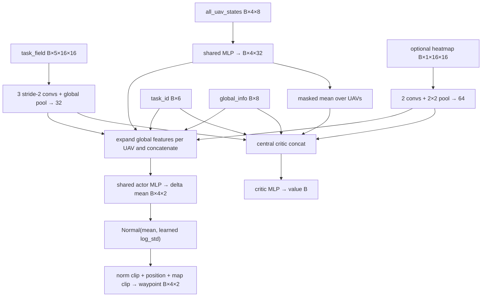

# Heatmap Architecture and Policy Audit

Date: 2026-07-24

Evidence labels used below are **Code-confirmed**, **Config-confirmed**, **Runtime-probe-confirmed**, and **Unverified or ambiguous**. Line ranges refer to the repository state audited on this date.

## 1. Executive technical summary

- **Config-confirmed:** The completed capacity-controlled experiment is a 4-UAV, 16×16, 64-step `priority_inspection` task. OFF disables both observation and policy heatmap use; REAL enables the `priority_inspection` provider; ZERO enables the same architecture but selects the zero provider (`configs/experiments/priority_inspection_heatmap_{off,real,zero}_ablation_seed0.yaml:3-40`).
- **Code-confirmed:** All three conditions build `DirectWaypointPolicy` through `build_policy` (`policies/__init__.py:24-75`; `policies/direct_waypoint_policy.py:17-185`). The actor is a **centralized-input shared actor**: each agent output uses its encoded state plus shared task-field, task-ID, global-information and, when enabled, global heatmap features; weights are shared across agents (`policies/direct_waypoint_policy.py:282-336`). It is not strictly decentralized.
- **Runtime-probe-confirmed:** OFF has 20,453 parameters and 78-dimensional actor/critic inputs. REAL and ZERO are architecture-identical at 27,229 parameters and 142-dimensional inputs. The heatmap encoder itself has 632 parameters; the complete enabled-path increase is 6,776 parameters because actor and critic first layers also widen (`docs/results/heatmap_capacity_control/policy_architecture_probe.json:1-103`).
- **Code-confirmed:** The critic consumes globally pooled encoded UAV state together with global task-field, task ID, global information, and optional heatmap features (`policies/direct_waypoint_policy.py:283-336`).
- **Unverified or ambiguous:** The requested IRMV repository `/data0/pjs/Wayffusion` and Docker runtime were unavailable from this desktop session. The probe used the repository's real YAML and policy code under `/Users/a...../Wayffusion`, native Python 3.10.16/PyTorch 2.5.1 on CPU, with no training. It must not be represented as IRMV Docker validation (`docs/results/heatmap_capacity_control/policy_architecture_probe.json:2-14`).

## 2. Active pipeline

| Stage | Active symbol and evidence | Input → output / shape | Used? |
|---|---|---|---|
| Experiment definition | `priority_inspection_heatmap_*_ablation_seed0.yaml` (`configs/experiments/...:1-74`) | YAML → environment, policy, training mappings | Yes; **Config-confirmed** |
| Launcher/config | `main`, `load_experiment_config` (`scripts/train_mappo_waypoint.py:55-89,333-539`) | path/CLI → resolved configs, output directory | Yes; **Code-confirmed** |
| Provider registration | `register_heatmap_task_element_providers` (`scripts/train_mappo_waypoint.py:246-288`) | provider `source` → explicit registration | REAL/ ZERO only |
| Environment batch | `build_env_batch` (`scripts/train_mappo_waypoint.py:290-312`) and `SyncWaypointEnvBatch` (`utils/waypoint_vector_env.py:31-99`) | two envs → leading environment axis `E=2` | Yes (`training.env_backend: sync`, `num_envs: 2`; config lines 41-44) |
| Environment/task | `WaypointMultiUAVEnv` (`envs/waypoint_marl_env.py:22-87`) and `PriorityInspectionScenario` (`tasks/waypoint/priority_inspection.py:10-26`) | config/seed → world plus POI task state | Yes |
| Reset/source resolution | `reset` and `_refresh_task_element_heatmap` (`envs/waypoint_marl_env.py:93-110,248-296`) | scenario/world/task state → `[1,16,16]` heatmap | REAL/ZERO; OFF resolver exits to static source without exposing key |
| Observation | `get_global_state` (`envs/waypoint_marl_env.py:760-791`) | world/task → dictionary of NumPy arrays | Yes |
| Vectorization | `stack_global_observations` (`utils/waypoint_vector_env.py:14-15`) | list of single states → `[E,...]` arrays | Yes |
| Rollout | `collect_rollout` (`algorithms/mappo_waypoint.py:226-449`) | batched global state → policy outputs, env transitions | Yes, 32 steps |
| Buffer | `WaypointRolloutBuffer.add/build` (`algorithms/mappo_waypoint.py:64-110`) | copies each observation; stacks time axis → `[T,E,...]` | Yes |
| Policy/action | `get_action_and_value`, `_delta_to_waypoint` (`policies/direct_waypoint_policy.py:419-474`) | Gaussian 2-D delta `[E,4,2]` → absolute waypoint `[E,4,2]` | Yes |
| Environment transition | `SyncWaypointEnvBatch.step` → `WaypointMultiUAVEnv.step_global` (`utils/waypoint_vector_env.py:46-99`; `envs/waypoint_marl_env.py:428-521`) | per-UAV waypoint dict → reward, termination, next global state | Yes; normal per-agent `step` is inactive in training |
| Safety/control/dynamics | environment constructs `SafetyLayer`, configured action adapter, and dynamics backend (`envs/waypoint_marl_env.py:61-66,112-158`) | waypoint → validated/tracked command → world transition | Yes; defaults are waypoint velocity tracker and MPE-core backend |
| Reward | `PriorityInspectionScenario.compute_rewards` (`tasks/waypoint/priority_inspection.py:82-123`) | previous/current world, task state, transition → team/per-agent reward | Yes |
| MAPPO update | `compute_gae_returns`, `MAPPOWaypointTrainer.update` (`algorithms/mappo_waypoint.py:113-141,554-655`) | `[T,E]` values/rewards and `[T,E,...]` observations → optimizer updates | Yes |
| Evaluation | trainer evaluation dispatch and train schedule (`algorithms/mappo_waypoint.py:660-897,899-952`) | deterministic policy episodes with fixed episode seeds | Yes every 20 updates and final |
| Artifacts | callback/writer in launcher and checkpoint logic (`scripts/train_mappo_waypoint.py:315-331,509-539`; `algorithms/mappo_waypoint.py:953-975,1002-1027`) | records → TensorBoard, `training_metrics.csv`, evaluation CSV, `.pt` checkpoints | Yes |

## 3. Environment and task

| Property | Active value | Evidence |
|---|---|---|
| Environment | `WaypointMultiUAVEnv` | **Code-confirmed**, `envs/waypoint_marl_env.py:22-87` |
| Scenario | `PriorityInspectionScenario(name="priority_inspection")` | **Code-confirmed**, `tasks/waypoint/priority_inspection.py:10-13`; task registry `tasks/waypoint/__init__.py:12-25` |
| UAVs / grid / map | 4 / 16×16 / normalized map size 1.0 | **Config-confirmed**, config lines 8-11 |
| Episode limit | 64 steps | **Config-confirmed**, config line 11 |
| Action | one 2-D final waypoint per UAV; policy internally samples a 2-D delta | **Code-confirmed**, `envs/waypoint_marl_env.py:33-39,217-223`; `policies/direct_waypoint_policy.py:431-455` |
| Waypoint constraint | delta norm limited by `max_delta=0.20`; final coordinate clipped to `[0,1]` | **Config-confirmed**, config line 12; **Code-confirmed**, `policies/direct_waypoint_policy.py:419-429` and builder forwarding `policies/__init__.py:42-75` |
| Transition | `step_global` validates/adapts actions, advances dynamics, calls scenario reward/task mutation, optionally refreshes heatmap, then constructs same-transition global state | **Code-confirmed**, `envs/waypoint_marl_env.py:428-521` |
| POIs | 8 world-space XY points sampled safely; float weights sampled uniformly in `[0.5,2.0)`; deadline per POI; Boolean visited vector | **Config-confirmed**, config lines 15-18; **Code-confirmed**, `tasks/waypoint/priority_inspection.py:14-26` |
| Reward | `6*newly_weight + 0*approach - .4*repeats - 1*late_weight - .15*distance - 2*safety` under defaults | **Code-confirmed**, `tasks/waypoint/priority_inspection.py:82-120`; coefficients are runtime-configurable |
| Completion | weighted visited priority divided by total priority; also unweighted visited ratio | **Code-confirmed**, `tasks/waypoint/priority_inspection.py:142-154` |
| Success | weighted completion ≥ mission-goal-derived threshold; code fallback is 0.7 | **Code-confirmed**, `tasks/waypoint/priority_inspection.py:148-154`; **runtime-dependent** because `goal_value` may override fallback |
| Arrival rate | control/action-adapter transition metric surfaced in environment info, not the priority-inspection completion metric | **Code-confirmed**, `envs/waypoint_marl_env.py:691-758`; exact value is runtime-dependent |

## 4. Observation architecture

The active policy consumes the global observation, not the per-agent observation dictionaries (**Code-confirmed**, batch reset calls `get_global_state`, `utils/waypoint_vector_env.py:36-44`; policy reads fields at `policies/direct_waypoint_policy.py:243-336`). `T=32`, `E=2`, `N=4`, `G=16`.

| Consumed field | Meaning / dtype | Single env | Vectorized | Rollout | Normalization | Actor / critic |
|---|---|---:|---:|---:|---|---|
| `task_field` | five scenario/world spatial channels, float32 | `[5,G,G]` | `[E,5,G,G]` | `[T,E,5,G,G]` | space bounded `[0,1]`; no trainer normalization | both via 32-D CNN feature |
| `all_uav_states` | all UAV state vectors, float32 | `[N,8]` | `[E,N,8]` | `[T,E,N,8]` | policy does not normalize | actor per-agent 32-D token; critic masked mean |
| `task_id` | one-hot over six waypoint tasks, float32 | `[6]` | `[E,6]` | `[T,E,6]` | already one-hot | both directly; UVFA is off |
| `global_info` | eight global summary scalars, float32 | `[8]` | `[E,8]` | `[T,E,8]` | no policy/trainer normalization | expanded into every actor input; critic directly |
| `agent_mask` | valid-agent mask, Boolean/MultiBinary | `[N]` | `[E,N]` | `[T,E,N]` | none | masks distributions/pooling/losses |
| `task_element_heatmap` | normalized priority map, float32; enabled only | `[1,G,G]` | `[E,1,G,G]` | `[T,E,1,G,G]` | generator max-normalizes to `[0,1]` | both via shared 64-D heatmap feature |

Shapes and spaces are **Code-confirmed** at `envs/waypoint_marl_env.py:160-194,760-791`; vector and buffer shapes follow direct stacking at `utils/waypoint_vector_env.py:14-15` and `algorithms/mappo_waypoint.py:79-108`. The buffer copies arrays without value normalization. Reward normalization is separately disabled by config (`configs/experiments/priority_inspection_heatmap_*_ablation_seed0.yaml:53-56`).

`global_task_field`, `mission_goal`, `goal_mask`, and `comm_adjacency` are present in global state but are not active policy inputs: `task_field` takes precedence over its duplicate, and UVFA/communication are disabled (**Code-confirmed**, `policies/direct_waypoint_policy.py:243-244,293-325`; **Config-confirmed**, policy lines 31-37).

For REAL, the provider emits one raw `{x,y,priority}` element per unvisited POI after world-to-grid conversion (`envs/waypoint/priority_inspection_task_element_provider.py:9-70`). The generator accumulates same-cell weights, rejects invalid inputs, divides by the maximum, clips to `[0,1]`, and returns `[1,G,G]` float32 (`envs/waypoint/task_element_heatmap.py:8-50`). ZERO emits an empty sequence (`envs/waypoint/zero_task_element_provider.py:7-18`). Reset always calls the refresh helper; step-time refresh occurs only when observation, provider, and `refresh_on_step` are enabled (`envs/waypoint_marl_env.py:93-110,248-296,428-521`).

## 5. Current policy

- **Code-confirmed:** The UAV encoder is shared `Linear(8,32)-ReLU-Linear(32,32)-ReLU`; field encoder is `5→8→16→32` convolutional with kernel 3, stride 2, padding 1, ReLU, then adaptive 1×1 pooling (`policies/direct_waypoint_policy.py:81-93,124-130`).
- **Config-confirmed:** attention, spatial context, moment context, communication graph, connectivity auxiliary loss, and UVFA goal conditioning are all false (`configs/experiments/priority_inspection_heatmap_*_ablation_seed0.yaml:26-40`). No inactive module should be interpreted as part of this experiment.
- **Code-confirmed:** Actor MLP is `input→32→32→2`; critic is `input→64→64→1`, with ReLU between linear layers (`policies/direct_waypoint_policy.py:146-185`).
- **Code-confirmed:** The stochastic action is a diagonal Normal with one learned two-element `log_std`; training uses `rsample`, evaluation can use the mean/deterministic conversion, and log probability/entropy are summed over XY (`policies/direct_waypoint_policy.py:431-474`; evaluation path `utils/waypoint_evaluation.py:75-187`).
- **Code-confirmed:** Both actor and critic receive global inputs. Actor parameters are shared across UAV positions in the tensor; it is therefore a centralized-input shared actor, while the critic is a centralized team-value critic (`policies/direct_waypoint_policy.py:282-336`).

## 6. Exact heatmap policy change

The policy flag is `use_task_element_heatmap` (**Config-confirmed**, config line 37). `build_policy` forwards it to `DirectWaypointPolicy` (**Code-confirmed**, `policies/__init__.py:24-75`). When true, the policy requires `[C,G,G]` in the observation space and creates `Conv2d(C,4,3,1,1)-ReLU-Conv2d(4,16,3,1,1)-ReLU-AdaptiveAvgPool2d(2,2)-Flatten`, producing 64 features for `C=1` (**Code-confirmed**, `policies/direct_waypoint_policy.py:94-122`). That feature is appended at the actor fusion point and the non-UVFA critic fusion point (`policies/direct_waypoint_policy.py:282-336`). UVFA fusion code exists but is inactive.

| Condition | Heatmap obs | Provider | Encoder | Actor input | Critic input | Total / trainable | Encoder params | Total heatmap-path increment | Action / value |
|---|---|---|---|---:|---:|---:|---:|---:|---:|
| OFF | no | none | absent | 78 | 78 | 20,453 / 20,453 | 0 | 0 | 2 / 1 |
| REAL | yes | priority inspection | present | 142 | 142 | 27,229 / 27,229 | 632 | 6,776 | 2 / 1 |
| ZERO | yes | zero | present | 142 | 142 | 27,229 / 27,229 | 632 | 6,776 | 2 / 1 |

The table is **Runtime-probe-confirmed** (`docs/results/heatmap_capacity_control/policy_parameter_counts.csv:1-4`). “Heatmap-specific parameter count” is potentially ambiguous: the direct encoder owns 632 parameters, while enabling the path adds 6,776 total parameters (632 encoder + 2,048 actor widening + 4,096 critic widening). Disabled checkpoints are structurally compatible only with the disabled architecture; strict OFF↔enabled loading is not compatible because keys and first-layer shapes differ (**Code-confirmed**, `tests/test_direct_waypoint_policy_heatmap_consumption.py:97-165,258-276`). Output shapes do not change.

## 7. Runtime architecture probe

The machine-readable probe records module trees, named parameter shapes, counts, and forward/action/value shapes (`docs/results/heatmap_capacity_control/policy_architecture_probe.json:1-103`). It instantiated seed-0 OFF/REAL/ZERO configs through the repository policy builder, seeded Python/NumPy/PyTorch with 0, and used batch size 2. Outputs were delta `[2,4,2]`, value `[2]`, mask `[2,4]`, and deterministic/sampled waypoint `[2,4,2]` (**Runtime-probe-confirmed**).

REAL and ZERO have identical module structure and parameter shapes/counts; their semantic inputs differ, not their network capacity. OFF differs by the absent encoder and the expected 64-column widening of actor and critic first layers (**Runtime-probe-confirmed**). No training or optimizer step was performed.

**Unverified or ambiguous:** This is a native local probe, not the requested IRMV Docker probe, because `/data0/pjs/Wayffusion` and Docker were unavailable. Re-running the saved probe procedure in the experiment container remains necessary for Docker-specific confirmation.

## 8. MAPPO algorithm

- **Code-confirmed:** A rollout stores observation dictionaries, environment and train actions, per-agent old log probabilities, team value/reward, per-agent reward, terminal/truncation masks and info; observations are copied and stacked to `[T,E,...]` (`algorithms/mappo_waypoint.py:46-110`).
- **Code-confirmed:** GAE uses `delta=r+gamma*next_value*(not terminated)-value`; recursion stops at any reset, while time-limit truncation still bootstraps (`algorithms/mappo_waypoint.py:113-141`). **Config-confirmed:** `gamma=.99`, `lambda=.95` (config lines 48-49).
- **Code-confirmed:** Per-agent PPO ratios use the shared team advantage, clipped surrogate maximum, masked mean, value MSE `0.5*(V-return)^2`, entropy bonus, Adam, and global gradient clipping (`algorithms/mappo_waypoint.py:554-647`).
- **Config-confirmed:** 2 epochs, minibatch 64, clip .2, entropy coefficient .01, value coefficient .5, Adam LR .0003 with constant schedule, max grad norm .5, target KL .05, advantage normalization on, reward normalization off (`configs/experiments/priority_inspection_heatmap_*_ablation_seed0.yaml:41-58`).
- **Code-confirmed:** rollout sampling is stochastic; evaluation uses deterministic policy actions (`algorithms/mappo_waypoint.py:325-330`; `utils/waypoint_evaluation.py:75-187`). The same policy parameters generate all four UAV actions.

## 9. Training/evaluation logging architecture

`MAPPOWaypointTrainer.train` runs 200 collect/update cycles, evaluates every 20 updates with the ordered eight seeds 10000–10007, writes periodic and best checkpoints, and forwards records to a logging callback (**Config-confirmed**, config lines 45,60-74; **Code-confirmed**, `algorithms/mappo_waypoint.py:899-975`). The launcher creates a TensorBoard writer, records scalar metrics through the callback, and writes `training_metrics.csv` (`scripts/train_mappo_waypoint.py:315-331,509-539`). Evaluation appends detailed evaluation CSV records and returns summaries (`algorithms/mappo_waypoint.py:660-897`). Checkpoints contain `model_state_dict` and `train_config` (`algorithms/mappo_waypoint.py:953-970`).

## 10. Evidence and tests

| Evidence | Exact test(s) |
|---|---|
| Generator accumulation, normalization, empty/invalid/order contract | `tests/test_task_element_heatmap_generator.py:21-111` |
| Environment observation and static integration | `tests/test_heatmap_observation_contract.py:29-89`; `tests/test_heatmap_environment_integration.py:71-136` |
| Dynamic reset/step/terminal refresh | `tests/test_task_element_provider_dynamic_refresh.py:103-292` |
| REAL provider registration and coordinate orientation | `tests/test_priority_inspection_provider_registration_integration.py:98-153` |
| Vector rollout, optimizer update, enabled/disabled activation | `tests/test_heatmap_training_activation_smoke.py:104-190` |
| Policy shapes, spatial sensitivity, actor/critic gradient paths, malformed input and checkpoint boundary | `tests/test_direct_waypoint_policy_heatmap_consumption.py:79-276` |
| Baseline observation/policy/buffer compatibility | `tests/test_heatmap_baseline_contracts.py:86-164` |
| OFF/REAL/ZERO activation, zero-provider path, fixed evaluation seeds, matched architecture | `tests/test_heatmap_capacity_control_contract.py:103-402` |
| Completed multi-seed protocol | `tests/test_heatmap_multiseed_ablation_contract.py:59-232` |

These locations establish code-contract evidence. **Unverified or ambiguous:** this audit did not rerun the entire training suite or inspect every saved checkpoint tensor; assertions about completed experimental outcomes should come from the preserved result artifacts, not from architecture tests alone.

## 11. Important caveats

1. **Unverified or ambiguous:** Docker-specific versions, GPU, and exact container module representations were not available here.
2. **Code-confirmed:** REAL's heatmap is recomputed after task-state mutation only because `refresh_on_step=true`; the feature remains normalized relative to the maximum remaining accumulated priority, so absolute scale is intentionally discarded (`envs/waypoint/task_element_heatmap.py:38-50`; config lines 22-25).
3. **Code-confirmed:** ZERO controls network capacity, but zero heatmap biases still participate in the encoder; it is not mathematically identical to removing the encoder.
4. **Code-confirmed:** The actor sees global task/map/information and all UAV states (through individual tokens and global inputs). Any scientific description as “decentralized execution” would require an additional local-observation execution path that is not active here (`policies/direct_waypoint_policy.py:282-336`).
5. **Config-confirmed:** Seed 0 fixes policy initialization across conditions, and evaluation episode seeds are paired; environment trajectories can still diverge because learned actions differ.

## 12. Questions requiring PhD design decisions

These are explicitly unresolved design choices, not repository facts:

1. Should “heatmap-specific capacity” mean only the 632 encoder parameters or the full 6,776 enabled-path increase?
2. Is centralized global input acceptable at deployment, or must the actor be redesigned/tested against strictly local information?
3. Is max normalization scientifically desirable when the number and absolute total priority of remaining POIs changes?
4. Should deadlines and repeat-visit semantics become additional channels, or remain outside the heatmap?
5. Is reset-and-step refresh sufficient, or should provider computation be profiled/cached for larger grids?
6. What checkpoint migration policy is required between OFF and enabled architectures, given strict incompatibility?
7. Should the IRMV Docker probe be archived alongside this local probe before publication to remove the remaining runtime ambiguity?
